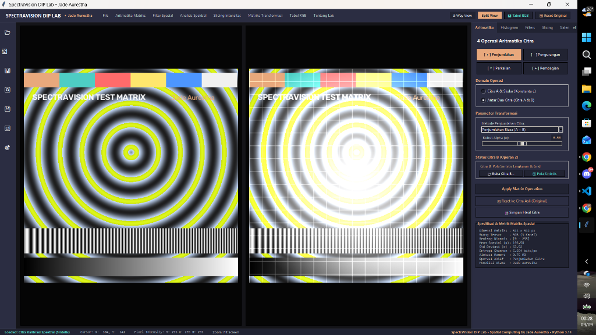
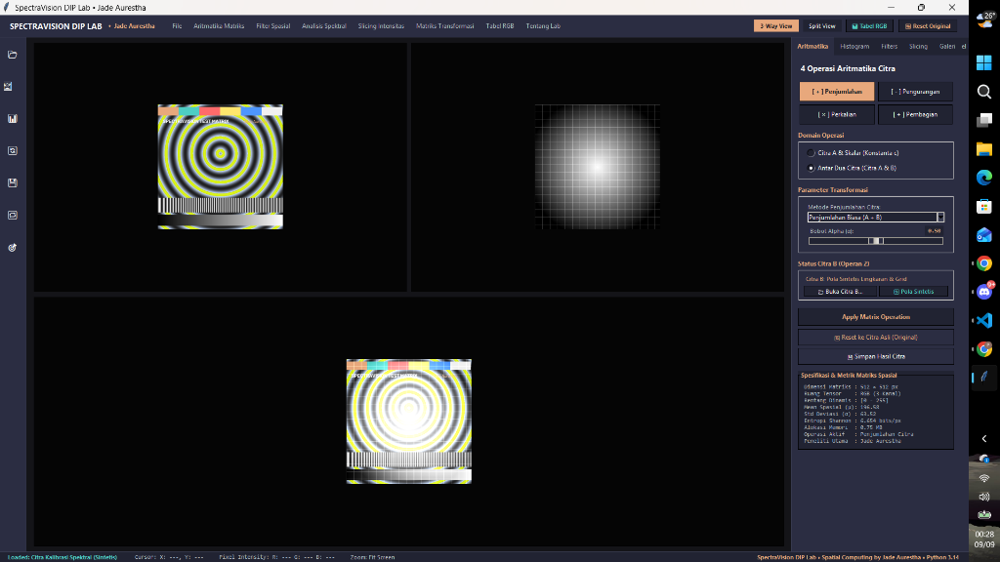
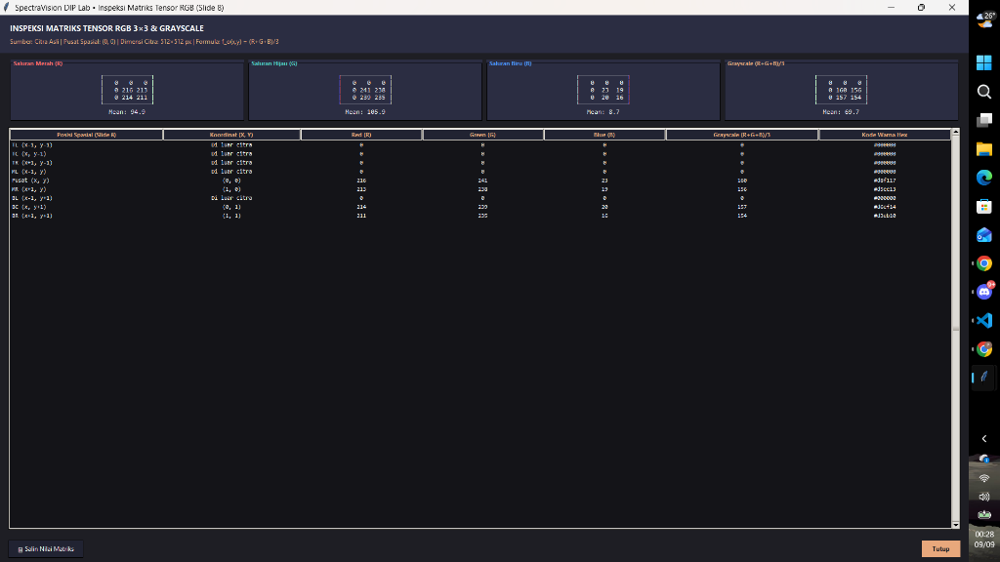

# 🔬 SpectraVision DIP Laboratory — Digital Image Processing & Spatial Matrix Studio

> **Dokumentasi resmi platform akademik dan modul komputasi matriks citra digital Putu Pasek Jade Aurestha (NIM: 2505551051), mahasiswa Teknologi Informasi Universitas Udayana angkatan 2025.**  
> Aplikasi desktop pemrosesan citra digital tingkat lanjut (*Digital Image Processing*), komputasi tensor spasial, dan analisis spektral waktu-nyata (*real-time*) berbasis **Python 3.14**, **Tkinter**, **OpenCV**, **NumPy**, **Scikit-Image**, dan **Matplotlib**. Dilengkapi arsitektur modular berorientasi objek (*Object-Oriented Architecture*), antarmuka bertema *Dark Slate & Peach Scientific Studio UI*, 4 operasi aritmatika matriks lengkap (Penjumlahan, Pengurangan, Perkalian, Pembagian), deteksi tepi konvolusi, *intensity & bit-plane slicing*, kurva densitas histogram spektral *dual-wave*, ekstraksi fitur tekstur GLCM Haralick, *live spatial telemetry*, serta tabel inspeksi RGB tensor $3 \times 3$ interaktif sesuai standar kurikulum PCD.

---

## 📑 Daftar Isi

- [1. Fitur & Arsitektur Modular](#1-fitur--arsitektur-modular)
- [2. Tech Stack](#2-tech-stack)
- [3. Langkah-Langkah Instalasi (Step-by-Step)](#3-langkah-langkah-instalasi-step-by-step)
- [4. Trace Alur Eksekusi Aplikasi](#4-trace-alur-eksekusi-aplikasi)
- [5. Struktur Data Matriks, Tensor & Parameter Ilmiah](#5-struktur-data-matriks-tensor--parameter-ilmiah)
- [6. Bedah Code: Pipeline Pemrosesan & Manajemen State Reaktif](#6-bedah-code-pipeline-pemrosesan--manajemen-state-reaktif)
- [7. Panduan Screenshot UI & Representasi Visual](#7-panduan-screenshot-ui--representasi-visual)
- [8. Mapping Komponen Antarmuka & Tata Letak UI](#8-mapping-komponen-antarmuka--tata-letak-ui)

---

## 1. Fitur & Arsitektur Modular

Aplikasi memisahkan antarmuka dan pipeline pemrosesan menjadi modul-modul fungsional terisolasi yang diintegrasikan di dalam kelas utama `SpectraVisionStudio`:

- **Operasi Aritmatika Matriks Citra (`_build_section_arithmetic`)**:  
  Mendukung 4 operasi aritmatika fundamental citra digital baik mode **Skalar** maupun **Antar-Citra (Citra A & B)**:
  - **Penjumlahan ($+$)**: Penjumlahan Citra ($A + B$), *Alpha Blending* dinamis ($\alpha A + (1-\alpha)B$), *Image Averaging* $\frac{A + B}{2}$, dan skalar pencerahan ($A + c$).
  - **Pengurangan ($-$)**: Pengurangan Terarah ($A - B$), Selisih Mutlak Spasial $|A - B|$, dan skalar reduksi intensitas ($A - c$).
  - **Perkalian ($\times$)**: Perkalian Masking Ternormalisasi $\frac{A \times B}{255}$ dan penskalaan kontras linear ($A \times c$).
  - **Pembagian ($\div$)**: Rasio Spektral Aman $\frac{A}{B + 1} \times 255$ dan penskalaan reduksi dinamis ($A \div c$).
  - Dilengkapi pencegahan *integer overflow/underflow* melalui pemotongan tensor otomatis `np.clip(..., 0, 255).astype(np.uint8)`.

- **Filter Spasial & Konvolusi Morfologi (`_build_section_filters`)**:  
  Menyediakan filter linier dan non-linier terintegrasi:
  - *Gaussian Smoothing Blur* dengan penegakan kernel ganjil ketat ($1 \times 1$ hingga $31 \times 31$).
  - *Canny Edge Detection* dengan ambang histeresis ganda dinamis ($T_1$ dan $T_2$).
  - *Sobel Gradient Operator* (komputasi magnitudo gradien spasial horisontal dan vertikal).
  - *Laplacian 2nd Derivative* untuk deteksi tepi omnidirectional.
  - *Adaptive Otsu Thresholding*, *Thermal Jet False-Color Mapping*, *Emboss 3D Texture*, dan *Contour Boundary Detection*.

- **Intensity & Bit-Plane Slicing (`_build_section_slicing`)**:  
  Menganalisis distribusi intensitas citra pada tingkat kuantisasi dan dekomposisi biner:
  - *Gray-Level Slicing* rentang $[V_{\min}, V_{\max}]$ dengan opsi *Preserve Background* atau *Binarized Highlight*.
  - *Bit-Plane Slicing* dekomposisi 8-bit individual (Bit 0 LSB hingga Bit 7 MSB) serta rekonstruksi bit signifikan.

- **Analisis Spektral & GLCM Haralick (`_build_section_histogram`)**:  
  Analisis statistik citra secara komprehensif:
  - *Dual-Wave Density Plot*: Visualisasi histogram komparasi langsung antara Citra Asli (Peach `#E8A87C`) dan Citra Hasil (Teal `#4ECDC4`).
  - *Metrik Statistik Orde Pertama*: Entropi Informasi Shannon ($-\sum p \log_2 p$), Nilai Rata-rata Spasial ($\mu$), dan Standar Deviasi ($\sigma$).
  - *Fitur Tekstur Orde Kedua (Haralick GLCM)*: *Contrast*, *Dissimilarity*, *Homogeneity*, *Energy*, dan *Correlation*.

- **Tabel & Matriks RGB Spasial (`_build_section_rgb_table` & `show_rgb_table_dialog`)**:  
  Mengimplementasikan materi perkuliahan Pengolahan Citra Digital (Slide 8):
  - Membaca intensitas 9 piksel ketetanggaan $3 \times 3$ ($TL, TC, TR, ML, [C], MR, BL, BC, BR$).
  - Menghitung nilai *Grayscale* aktual melalui formula:  
    $$f_o(x, y) = \frac{R + G + B}{3}$$
  - *Live Canvas Click-to-Inspect*: Mengklik area mana saja pada kanvas citra langsung memperbarui koordinat $(X, Y)$, kotak warna (*swatch*), dan tabel matriks secara *real-time*.
  - *Dialog 4 Sub-Matriks*: Menampilkan representasi matriks terpisah untuk Saluran Merah ($R$), Hijau ($G$), Biru ($B$), dan Grayscale.
  - Ekspor data matriks ke *Clipboard* dalam format ilmiah/TSV.

- **Dual & 3-Way Interactive Viewport Engine (`refresh_active_view`)**:  
  Menyajikan mode komparasi visual fleksibel: *Dual Split-View* (Asli vs Hasil) dan *3-Way View* (Citra A, Citra B, dan Hasil Aritmatika) dengan penskalaan aspek rasio otomatis (*aspect-ratio preserving scale*).

---

## 2. Tech Stack

| Kategori | Teknologi / Pustaka | Deskripsi Fungsional |
| :--- | :--- | :--- |
| **Core Runtime** | **Python 3.14+** | Bahasa pemrograman utama dengan performa komputasi numerik tinggi |
| **GUI Framework** | **Tkinter & Ttk (Clam Engine)** | Antarmuka grafis desktop modular dengan palet warna kustom *Dark Slate & Peach* |
| **Matrix Computing** | **NumPy 2.x** | Komputasi array tensor multidimensi $H \times W \times C$, vektorisasi, & clipping |
| **Computer Vision** | **OpenCV (cv2)** | Engine pemrosesan filter spasial, konvolusi, segmentasi, dan konversi warna |
| **Image Pipeline** | **Pillow (PIL)** | Penghubung konversi tensor NumPy ke objek visual `ImageTk.PhotoImage` |
| **Texture Analysis** | **Scikit-Image (`skimage`)** | Ekstraksi matriks ko-okurensi spasial GLCM dan kalkulasi properti Haralick |
| **Plotting & Spectral** | **Matplotlib (`FigureCanvasTkAgg`)** | Rendering kurva densitas histogram spektral dual-wave terintegrasi dalam GUI |
| **Data Tabulation** | **Pandas & Ttk Treeview** | Penataan struktur data tabular untuk inspeksi ketetanggaan piksel RGB $3 \times 3$ |

---

## 3. Langkah-Langkah Instalasi (Step-by-Step)

Jalankan perintah PowerShell / Terminal berikut secara berurutan untuk menyiapkan lingkungan eksekusi dan menjalankan aplikasi:

```powershell
# 1. Masuk ke direktori proyek SpectraVision
cd d:\testing\spectravision

# 2. (Opsional) Buat dan aktifkan lingkungan virtual Python
python -m venv venv
.\venv\Scripts\Activate.ps1

# 3. Perbarui pip ke versi terbaru
python -m pip install --upgrade pip

# 4. Install seluruh pustaka pengolahan citra dan visualisasi
pip install numpy opencv-python pillow scikit-image matplotlib pandas

# 5. Jalankan aplikasi SpectraVision DIP Laboratory
python main.py
```

> **Catatan Akses Cepat:** Jika sistem Anda telah terpasang dependensi di atas pada instalasi global Python 3.14, aplikasi dapat langsung diluncurkan melalui perintah `python main.py`.

---

## 4. Trace Alur Eksekusi Aplikasi

Alur inisialisasi, pemrosesan citra, rekonsiliasi tensor, hingga rendering visual pada antarmuka:

```
[ main.py Entry ] 
       │
       ▼
[ SpectraVisionStudio.__init__() ] ──> [ _setup_ttk_styles() ] (Dark Slate & Peach Theme)
       │
       ├─► [ _build_top_menu_bar() ]        (File, Aritmatika, Filter, Spektral, Slicing, Tabel RGB)
       ├─► [ _build_main_workspace() ]      (Left Dock, Dual/3-Way Viewport Canvas, Right Tabs)
       └─► [ _build_bottom_status_bar() ]   (Live Cursor & Pixel Intensity Telemetry)
       │
       ▼
[ Pipeline Data Inisial ] ──► [ _generate_synthetic_test_chart() ] ──> [ img_a_orig ]
                          └──► [ _generate_default_image_b() ]      ──> [ img_b_orig ]
       │
       ▼
[ Event Loop Tkinter / Interaksi Pengguna ]
       │
       ├─► [ Slider / Tombol Berubah ] ──> [ on_arithmetic_change() / on_filter_param_change() ]
       │                                         │
       │                                         ▼
       │                                   [ NumPy / OpenCV Vectorized Engine ]
       │                                         │
       │                                         ▼
       │                                   [ np.clip(..., 0, 255).astype(np.uint8) ]
       │                                         │
       │                                         ▼
       │                                   [ img_processed diperbarui ]
       │
       ├─► [ Klik Kanvas Mouse ] ─────────► [ _on_canvas_click() ]
       │                                         │
       │                                         ▼
       │                                   [ Mapping Koordinat Kanvas ke Spasial Tensor ]
       │                                         │
       │                                         ▼
       │                                   [ _update_rgb_table() (Ekstraksi 3x3 & Slide 8) ]
       │
       └─► [ Refresh Viewport ] ──────────► [ _display_on_widget() via Pillow & ImageTk ]
                                                 │
                                                 ▼
                                           [ Update Canvas UI & Label Status Telemetri ]
```

---

## 5. Struktur Data Matriks, Tensor & Parameter Ilmiah

SpectraVision DIP Lab memproses citra murni sebagai representasi tensor diskrit matematis berordo 2 (Grayscale) atau berordo 3 (RGB):

### A. Format Tensor Citra
- **Ruang Tensor**: Array NumPy berdimensi $(H \times W \times C)$ dengan tipe data `uint8` (nilai $[0 - 255]$).
- **Format Warna**: $R$ (*Saluran Merah*), $G$ (*Saluran Hijau*), dan $B$ (*Saluran Biru*).

### B. Rumus 4 Operasi Aritmatika Matriks Citra
1. **Penjumlahan Citra ($A + B$)**:
   $$C(x,y) = \min(A(x,y) + B(x,y), 255)$$
2. **Alpha Blending ($\alpha A + (1-\alpha)B$)**:
   $$C(x,y) = \operatorname{clip}(\alpha \cdot A(x,y) + (1 - \alpha) \cdot B(x,y), 0, 255)$$
3. **Pengurangan Terarah & Selisih Mutlak ($|A - B|$)**:
   $$C_{\text{diff}}(x,y) = |A(x,y) - B(x,y)|$$
4. **Perkalian Ternormalisasi ($A \times B$)**:
   $$C(x,y) = \frac{A(x,y) \times B(x,y)}{255.0}$$
5. **Rasio Spektral Pembagian ($A \div B$)**:
   $$C(x,y) = \operatorname{clip}\left(\frac{A(x,y)}{B(x,y) + \epsilon} \times 255.0, 0, 255\right), \quad \epsilon = 1.0$$

### C. Kernel Konvolusi Filter Spasial & Grayscale
- **Gaussian Smoothing Function**:
  $$G(x, y) = \frac{1}{2\pi\sigma^2} \exp\left(-\frac{x^2 + y^2}{2\sigma^2}\right)$$
- **Grayscale Formula (Kurikulum PCD Slide 8)**:
  $$f_o(x, y) = \frac{R(x, y) + G(x, y) + B(x, y)}{3}$$
- **Entropi Informasi Shannon (Ketidakpastian Distribusi Spektral)**:
  $$H = -\sum_{i=0}^{255} p(i) \log_2 p(i)$$

---

## 6. Bedah Code: Pipeline Pemrosesan & Manajemen State Reaktif

Pengelolaan state dan reaktivitas studio berpusat pada atribut-atribut kelas `SpectraVisionStudio`:

### A. Lima State Utama
```python
# 1. State Matriks Citra Utama (Operan A)
self.img_a_orig = None        # Tensor citra input utama (RGB)
self.img_a_initial = None     # Cadangan kondisi murni untuk fungsi Reset Original

# 2. State Matriks Citra Sekunder (Operan B)
self.img_b_orig = None        # Tensor citra operan kedua untuk operasi antar-citra

# 3. State Matriks Hasil Transformasi (Output Pipeline)
self.img_processed = None     # Tensor hasil komputasi aktif

# 4. State Parameter Terikat GUI (Tkinter Reactive Variables)
self.var_arith_op = tk.StringVar(value="Penjumlahan (+)")
self.var_arith_alpha = tk.DoubleVar(value=0.5)
self.var_blur = tk.IntVar(value=1)
self.var_canny1 = tk.IntVar(value=100)
self.var_canny2 = tk.IntVar(value=200)

# 5. State Telemetri & Tabel RGB
self.var_rgb_source = tk.StringVar(value="Citra Asli")
self.var_rgb_x = tk.IntVar(value=0)
self.var_rgb_y = tk.IntVar(value=0)
```

### B. Pipeline Operasi Aritmatika dengan Proteksi Overflow
```python
def on_arithmetic_change(self, *args):
    """Mengeksekusi 4 operasi aritmatika citra dengan pencocokan dimensi otomatis."""
    if self.img_a_orig is None:
        return

    op = self.var_arith_op.get()
    target_mode = self.var_arith_target.get()
    a_float = self.img_a_orig.astype(np.float32)

    if "Antar Citra" in target_mode:
        # Menyamakan dimensi spasial Citra B terhadap Citra A
        h, w = self.img_a_orig.shape[:2]
        b_resized = cv2.resize(self.img_b_orig, (w, h)).astype(np.float32)

        if "Penjumlahan" in op:
            mode = self.var_add_mode.get()
            if "Alpha Blending" in mode:
                alpha = self.var_arith_alpha.get()
                res = alpha * a_float + (1.0 - alpha) * b_resized
            elif "Rata-rata" in mode:
                res = (a_float + b_resized) / 2.0
            else:
                res = a_float + b_resized
        elif "Pengurangan" in op:
            res = np.abs(a_float - b_resized) if "Mutlak" in self.var_sub_mode.get() else (a_float - b_resized)
        elif "Perkalian" in op:
            res = (a_float * b_resized) / 255.0
        elif "Pembagian" in op:
            res = (a_float / (b_resized + 1.0)) * 255.0

    # Penjepitan nilai matematis [0, 255] untuk mencegah distorsi bit
    self.img_processed = np.clip(res, 0, 255).astype(np.uint8)
    self.refresh_active_view()
```

### C. Ekstraksi Matriks Ketetanggaan $3 \times 3$ & Formulasi Slide 8
```python
def _update_rgb_table(self):
    """Ekstraksi intensitas piksel 3x3 dan kalkulasi Grayscale sesuai Slide 8."""
    target_img = self.img_processed if self.var_rgb_source.get() == "Citra Hasil" else self.img_a_orig
    h, w = target_img.shape[:2]
    cx = max(0, min(w - 1, self.var_rgb_x.get()))
    cy = max(0, min(h - 1, self.var_rgb_y.get()))

    offsets = [
        (-1, -1, "TL"), (-1, 0, "TC"), (-1, 1, "TR"),
        ( 0, -1, "ML"), ( 0, 0, "C" ), ( 0, 1, "MR"),
        ( 1, -1, "BL"), ( 1, 0, "BC"), ( 1, 1, "BR")
    ]
    for dy, dx, pos_tag in offsets:
        nx, ny = cx + dx, cy + dy
        if 0 <= nx < w and 0 <= ny < h:
            px = target_img[ny, nx]
            r, g, b = (int(px[0]), int(px[1]), int(px[2])) if len(target_img.shape) == 3 else (int(px), int(px), int(px))
            # Implementasi formula Slide 8
            gray = (r + g + b) // 3
            coord_str = f"({nx},{ny})"
        else:
            r, g, b, gray, coord_str = 0, 0, 0, 0, "Tepi"

        pos_display = "[C]" if pos_tag == "C" else pos_tag
        self.tree_rgb.insert("", tk.END, values=(pos_display, coord_str, r, g, b, gray))
```

---

## 7. Panduan Screenshot UI & Representasi Visual

Antarmuka mengusung palet warna *Dark Slate & Peach* (`#1E1E24`, `#2B2D42`, `#E8A87C`) dengan sudut tombol terkurvatur lembut, visualisasi *split-view*, dan panel akordeon fungsional:

### A. Viewport Utama: Mode Dual Split-View & Kontrol Aritmatika
Representasi antarmuka saat pengguna melakukan komparasi citra asli dan pengolahan citra pada kanvas *split-view* (Citra Asli di sisi kiri dan Citra Hasil di sisi kanan) serta panel kontrol operasi aritmatika dan metrik spesifikasi spasial di sisi kanan:



### B. Viewport Mode 3-Way: Komparasi Citra A, Citra B, dan Hasil Aritmatika
Representasi antarmuka saat mengeksekusi operasi aritmatika antar dua citra (Citra A di kiri atas, Citra B di kanan atas, dan Hasil Transformasi Aritmatika Spasial di panel bawah):



### C. Tabel & Dialog Inspeksi Matriks RGB $3 \times 3$ (Slide 8)
Representasi dialog modal ilmiah saat menginspeksi nilai tensor numerik pada 9 piksel ketetanggaan ($3 \times 3$) beserta pemisahan 4 sub-matriks saluran warna (Merah, Hijau, Biru, dan Grayscale sesuai formula Slide 8):



---

## 8. Mapping Komponen Antarmuka & Tata Letak UI

| Komponen GUI | Lokasi / Objek Widget | Fungsi & Peran Ilmiah |
| :--- | :--- | :--- |
| **Top Menu Bar** | `_build_top_menu_bar` (`tk.Frame`) | Membungkus identitas laboratorium, menu file, pintasan reset, dan navigasi tab cepat |
| **Left Tool Dock** | `left_dock` (`tk.Frame`, 50px) | Panel aksi cepat (Buka Citra A/B, Tabel RGB, Reset Original, Simpan Citra, Sampel Matriks) |
| **Dual Viewport** | `frame_dual` (`self.lbl_view_orig` & `lbl_view_proc`) | Menampilkan komparasi citra asli vs citra hasil dengan penanganan klik kursor live |
| **3-Way Viewport** | `frame_3way` (`lbl_3way_a`, `lbl_3way_b`, `lbl_3way_res`) | Menampilkan visualisasi matriks operan 1, operan 2, dan hasil operasi aritmatika spasial |
| **Right Control Panel** | `self.right_panel` (`ttk.Notebook` / Tab Frame) | Wadah akordeon parameter interaktif (Aritmatika, Histogram, Filter, Slicing, Galeri, Tabel RGB) |
| **Spectral Density Canvas** | `FigureCanvasTkAgg` (`_update_histogram_chart`) | Rendering grafik densitas dual-wave Matplotlib untuk citra input vs citra output |
| **RGB Table Treeview** | `self.tree_rgb` (`ttk.Treeview`) | Tabulasi data intensitas 9 piksel tetangga, koordinat, saluran RGB, dan Grayscale Slide 8 |
| **Bottom Status Bar** | `_build_bottom_status_bar` (`bar`) | Menampilkan telemetri kursor live $(X, Y)$, intensitas piksel $(R, G, B)$, status memori, & *watermark* |

---

<div align="center">

### SPECTRAVISION DIP LABORATORY
**Spatial Computing, Matrix Analysis & Digital Image Processing Suite**

Dibuat untuk memenuhi Tugas Terstruktur & Platform Portofolio Akademik  
Mata Kuliah Pengolahan Citra Digital (PCD)

**Putu Pasek Jade Aurestha**  
NIM: **2505551051**  
*Program Studi Teknologi Informasi, Fakultas Teknik, Universitas Udayana*  
Angkatan 2026

© 2026 Putu Pasek Jade Aurestha. All Rights Reserved.

</div>

